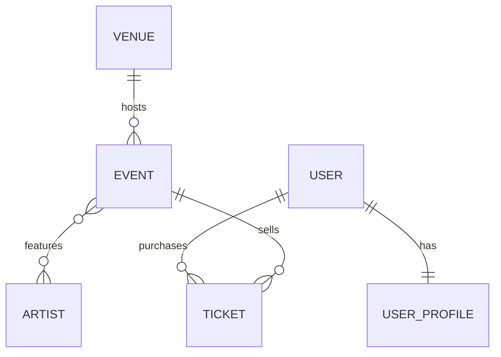

# PulsePass

Núcleo de persistencia de **PulsePass**, una plataforma de eventos, artistas y entradas. Es el caso de estudio de la capa de persistencia: modelo relacional versionado con Flyway, entidades JPA, repositories Spring Data y pruebas de integración contra PostgreSQL real con Testcontainers.

La fuente de verdad de los requisitos es `PRD_PulsePass.md`. Los IDs que aparecen abajo (`FR-*`, `BR-*`, `AC-*`, `QT-*`) son los de ese documento.

## Tecnologías

| Componente | Detalle |
|---|---|
| Lenguaje | Java 21 |
| Framework | Spring Boot 4.1.1 |
| Persistencia | Spring Data JPA / Hibernate |
| Base de datos | PostgreSQL |
| Migraciones | Flyway (único responsable del esquema) |
| Pruebas | JUnit 5, AssertJ, Testcontainers |
| Build | Maven (`./mvnw`) |

## Requisitos previos

- JDK 21.
- Docker en ejecución. Las pruebas levantan su propio PostgreSQL con Testcontainers, así que **no hace falta instalar PostgreSQL** para probar.

## Estructura

```
src/main/java/com/pulsepass/
├── domain/        entidades JPA y enums
└── repository/    interfaces JpaRepository con las consultas
src/main/resources/
├── application.yml
└── db/migration/  V1__create_schema, V2__insert_initial_artists, V3__add_streaming_url_to_event
src/test/java/com/pulsepass/   pruebas de integración
```

## Modelo de dominio



| Relación | Mapeo JPA | Tabla / columna |
|---|---|---|
| Venue 1:N Event | `@ManyToOne(fetch = LAZY)` en `Event.venue` | `events.venue_id` (FK, NOT NULL) |
| Event N:M Artist | `@ManyToMany` + `@JoinTable` en `Event.artists` (lado propietario) | `event_artists` con PK compuesta `(event_id, artist_id)` |
| User 1:1 UserProfile | `@OneToOne` en `UserProfile.user` | `user_profiles.user_id` (FK + UNIQUE) |
| User 1:N Ticket | `@ManyToOne(fetch = LAZY)` en `Ticket.user` | `tickets.user_id` (FK, NOT NULL) |
| Event 1:N Ticket | `@ManyToOne(fetch = LAZY)` en `Ticket.event` | `tickets.event_id` (FK, NOT NULL) |

`Ticket` es una entidad y no un `@ManyToMany` entre `User` y `Event` porque tiene datos propios: `ticketCode`, `type`, `price`, `status` y `purchaseDate` (BR-006).

Enums (`EventCategory`, `EventStatus`, `TicketType`, `TicketStatus`): se guardan con `@Enumerated(EnumType.STRING)`, nunca por ordinal (BR-008).

## Esquema y migraciones

| Migración | Qué hace |
|---|---|
| `V1__create_schema.sql` | Crea `venues`, `events`, `artists`, `event_artists`, `users`, `user_profiles` y `tickets`, con PK, FK, UNIQUE, CHECK e índices. |
| `V2__insert_initial_artists.sql` | Inserta el catálogo inicial: Solar Beat, Neon Waves, Caribbean Sound, Ocean Drive y Digital Pulse. |
| `V3__add_streaming_url_to_event.sql` | Agrega `events.streaming_url VARCHAR(500)` nullable, sin modificar V1. |

Una migración ya aplicada **no se edita**: cualquier cambio estructural nuevo va en una migración nueva (`V4__...`). Hibernate corre con `ddl-auto=validate`: solo comprueba que las entidades coincidan con el esquema, nunca lo crea ni lo modifica.

### Integridad reforzada en PostgreSQL

| Regla | Constraint |
|---|---|
| `venues.code`, `events.event_code`, `artists.stage_name`, `users.username`, `users.email`, `tickets.ticket_code` únicos | `UNIQUE` |
| Capacidad del venue mayor que cero | `CHECK (capacity > 0)` |
| Precio del ticket mayor o igual a cero | `CHECK (price >= 0)` |
| Categoría y estado del evento, tipo y estado del ticket dentro del catálogo | `CHECK (... IN (...))` |
| Un solo perfil por usuario | `UNIQUE (user_id)` en `user_profiles` |
| Sin pares evento-artista repetidos | PK compuesta en `event_artists` |
| Todo evento tiene venue; todo ticket tiene usuario y evento | FK `NOT NULL` |
| Precios con precisión decimal (BR-007, NFR-008) | `DECIMAL(10,2)` en BD, `BigDecimal` en Java |

## Consultas

Los métodos simples usan Query Methods; las consultas con agregación, `DISTINCT` o varias asociaciones usan JPQL (NFR-007). No hay SQL nativo en los repositories.

| Necesidad | Método | Mecanismo |
|---|---|---|
| Venue por código (FR-VEN-001) | `VenueRepository.findByCode` | Query Method |
| Evento por `eventCode` (AC-002) | `EventRepository.findByEventCode` | Query Method + `@EntityGraph(venue)` |
| Eventos de un venue por código (FR-VEN-004) | `EventRepository.findByVenue_CodeOrderByEventDateAsc` | Query Method navegando la relación |
| Eventos publicados por fecha (FR-EVT-005) | `EventRepository.findByStatusOrderByEventDateAsc` | Query Method |
| Eventos por artista (FR-SRC-001, FR-ART-004) | `EventRepository.findByArtistStageName` | JPQL con `JOIN` + `DISTINCT` |
| Eventos por ciudad y artista (FR-SRC-002) | `EventRepository.findByVenueCityAndArtistStageName` | JPQL con varias asociaciones |
| Eventos recomendados (FR-SRC-003) | `EventRepository.findRecommendedEvents` | JPQL con filtros, `DISTINCT`, `LOWER` y `ORDER BY` |
| Artista por nombre artístico | `ArtistRepository.findByStageName` | Query Method |
| Usuario por email sin distinguir mayúsculas | `UserRepository.findByEmailIgnoreCase` | Query Method |
| Usuario por username | `UserRepository.findByUsername` | Query Method |
| Perfil por usuario | `UserProfileRepository.findByUser_Id` | Query Method |
| Tickets de un usuario por email y estado (FR-TKT-006) | `TicketRepository.findByUser_EmailIgnoreCase[AndStatus]` | Query Method navegando la relación |
| Tickets PAID de un evento (FR-TKT-007) | `TicketRepository.findByEvent_EventCodeAndStatus` | Query Method |
| Conteo de tickets PAID (FR-TKT-008) | `TicketRepository.countPaidTicketsByEventCode` | JPQL con `COUNT` |
| Tickets de eventos futuros (FR-SRC-004) | `TicketRepository.findTicketsOfFutureEvents` | JPQL con `ORDER BY` |

**Por qué FR-TKT-007 es un Query Method:** es un filtro por dos atributos (uno navegando `event`) sin joins explícitos ni agregaciones; el nombre del método ya expresa la intención y no hace falta JPQL.

## Decisiones de diseño

- **Relaciones `LAZY` y `open-in-view=false`.** Un `Event` cargado fuera de una transacción trae su `venue` como proxy sin inicializar. Por eso `findByEventCode` usa `@EntityGraph(attributePaths = "venue")`: el evento y su venue llegan en una sola consulta (AC-002).
- **Identificadores `IDENTITY`.** Coinciden con `BIGSERIAL` en PostgreSQL. Como el `INSERT` se ejecuta al hacer `save`, una violación de UNIQUE aparece de inmediato.
- **`SOLD_OUT` no se calcula** (BR-010): el estado se persiste tal como llega.
- **Sin capa Service ni API REST**, como indica el alcance del PRD.

## Pruebas

```bash
./mvnw clean test
```

Requiere Docker en ejecución. Testcontainers levanta PostgreSQL, Flyway construye el esquema desde cero y luego se ejecutan repositories y consultas.

Las clases terminan en `Test` (no en `IT`) para que `mvn test` las ejecute con Surefire. Las pruebas que escriben datos corren en una transacción que se revierte al terminar, y las que verifican lo que quedó en la base llaman a `flushAndClear()` antes de consultar, para que los datos se lean de PostgreSQL y no de la caché de Hibernate.

| Clase | Cubre |
|---|---|
| `FlywayMigrationTest` | QT-001, QT-002, V2 con los cinco artistas |
| `VenuePersistenceTest` | FR-VEN-001 a 004, AC-001, QT-003, QT-009 |
| `EventRepositoryTest` | FR-EVT-001 a 006, AC-002, AC-006 |
| `EventArtistTest` | FR-ART-001 a 003, AC-003, QT-005 |
| `EventSearchTest` | FR-SRC-001 a 003, FR-ART-004, AC-007, QT-008 |
| `UserProfileTest` | FR-USR-001 a 004, AC-004, QT-004 |
| `TicketRepositoryTest` | FR-TKT-001 a 008, FR-SRC-004, AC-005, AC-008, QT-006 a QT-008 |
| `PulsepassApplicationTests` | El contexto de Spring arranca |

Algunas pruebas usan SQL nativo únicamente para **verificar** constraints de PostgreSQL (por ejemplo, forzar un estado fuera del catálogo o un par evento-artista repetido). Los requisitos de consulta se resuelven solo con Query Methods y JPQL.

## Ejecutar la aplicación

La aplicación no expone API: al arrancar, Flyway aplica las migraciones y Hibernate valida el esquema.

Con Testcontainers, sin instalar nada más:

```bash
./mvnw spring-boot:test-run
```

Contra un PostgreSQL propio:

```bash
docker run --name pulsepass-db -e POSTGRES_DB=pulsepass -e POSTGRES_PASSWORD=postgres -p 5432:5432 -d postgres:17
./mvnw spring-boot:run
```

La conexión se configura con las variables `DB_URL`, `DB_USER` y `DB_PASSWORD`. Sus valores por defecto son `jdbc:postgresql://localhost:5432/pulsepass`, `postgres` y `postgres`.
