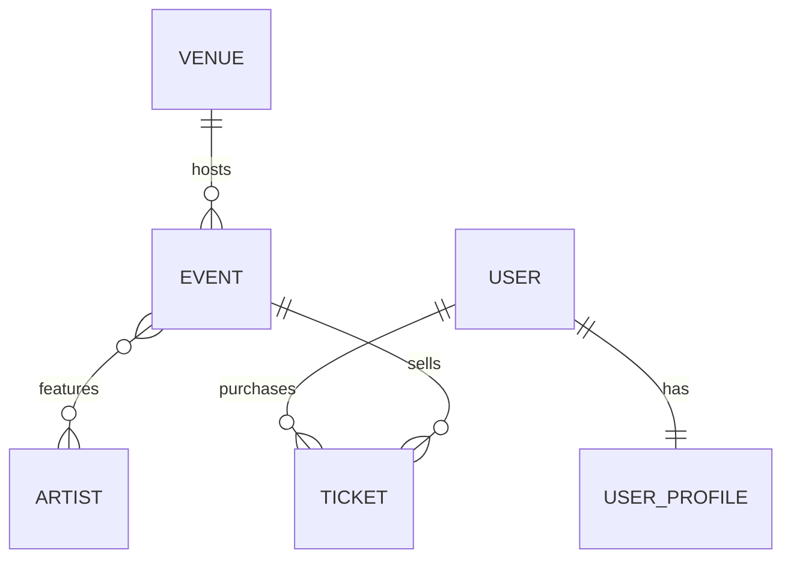

# PulsePass

Núcleo de **PulsePass**, una plataforma de eventos, artistas y entradas. Tiene dos capas:

- **Persistencia:** modelo relacional versionado con Flyway, entidades JPA, repositories Spring Data y pruebas de integración contra PostgreSQL real con Testcontainers.
- **Servicios:** reglas de negocio, transacciones, DTOs, mapeo con MapStruct, excepciones de dominio y pruebas unitarias con Mockito.

La fuente de verdad de los requisitos de persistencia es `PRD_PulsePass.md` y la de la capa de servicios es `PRD_PulsePass_Capa_Servicios`. Los IDs que aparecen abajo (`FR-*`, `BR-*`, `AC-*`, `QT-*`, `SRV-*`, `TEST-*`) son los de esos documentos.

## Tecnologías

| Componente | Detalle |
|---|---|
| Lenguaje | Java 21 |
| Framework | Spring Boot 4.1.1 |
| Persistencia | Spring Data JPA / Hibernate |
| Base de datos | PostgreSQL |
| Migraciones | Flyway (único responsable del esquema) |
| Mapeo Entity → DTO | MapStruct |
| Pruebas | JUnit 5, AssertJ, Mockito, Testcontainers |
| Build | Maven (`./mvnw`) |

## Requisitos previos

- JDK 21.
- Docker en ejecución para las pruebas de persistencia. Levantan su propio PostgreSQL con Testcontainers, así que **no hace falta instalar PostgreSQL** para probar. Las pruebas unitarias de la capa de servicios no necesitan Docker.

## Estructura

```
src/main/java/com/pulsepass/
├── domain/        entidades JPA y enums
├── repository/    interfaces JpaRepository con las consultas
├── dto/
│   ├── request/   records de entrada (CreateEventRequest, RegisterUserRequest, PurchaseTicketRequest)
│   └── response/  records de salida (VenueResponse, EventResponse, EventSummaryResponse, ...)
├── mapper/        mappers MapStruct Entity → DTO
├── exception/     excepciones de dominio
└── service/       interfaces de servicio
    └── impl/      implementaciones @Service y estrategia de precios
src/main/resources/
├── application.yml
└── db/migration/  V1__create_schema, V2__insert_initial_artists, V3__add_streaming_url_to_event
src/test/java/com/pulsepass/                pruebas de integración de persistencia
src/test/java/com/pulsepass/service/impl/   pruebas unitarias de servicios
```

## Modelo de dominio


```mermaid
erDiagram
    VENUE ||--o{ EVENT : hosts
    EVENT }o--o{ ARTIST : features
    USER ||--|| USER_PROFILE : has
    USER ||--o{ TICKET : purchases
    EVENT ||--o{ TICKET : sells
```

| Relación | Mapeo JPA | Tabla / columna |
|---|---|---|
| Venue 1:N Event | `@ManyToOne(fetch = LAZY)` en `Event.venue` | `events.venue_id` (FK, NOT NULL) |
| Event N:M Artist | `@ManyToMany` + `@JoinTable` en `Event.artists` (lado propietario) | `event_artists` con PK compuesta `(event_id, artist_id)` |
| User 1:1 UserProfile | `@OneToOne` en `UserProfile.user` | `user_profiles.user_id` (FK + UNIQUE) |
| User 1:N Ticket | `@ManyToOne(fetch = LAZY)` en `Ticket.user` | `tickets.user_id` (FK, NOT NULL) |
| Event 1:N Ticket | `@ManyToOne(fetch = LAZY)` en `Ticket.event` | `tickets.event_id` (FK, NOT NULL) |

`Ticket` es una entidad y no un `@ManyToMany` entre `User` y `Event` porque tiene datos propios: `ticketCode`, `type`, `price`, `status` y `purchaseDate` (BR-006).

Enums (`EventCategory`, `EventStatus`, `TicketType`, `TicketStatus`): se guardan con `@Enumerated(EnumType.STRING)`, nunca por ordinal (BR-008).

## Esquema y migraciones

| Migración | Qué hace |
|---|---|
| `V1__create_schema.sql` | Crea `venues`, `events`, `artists`, `event_artists`, `users`, `user_profiles` y `tickets`, con PK, FK, UNIQUE, CHECK e índices. |
| `V2__insert_initial_artists.sql` | Inserta el catálogo inicial: Solar Beat, Neon Waves, Caribbean Sound, Ocean Drive y Digital Pulse. |
| `V3__add_streaming_url_to_event.sql` | Agrega `events.streaming_url VARCHAR(500)` nullable, sin modificar V1. |

Una migración ya aplicada **no se edita**: cualquier cambio estructural nuevo va en una migración nueva (`V4__...`). Hibernate corre con `ddl-auto=validate`: solo comprueba que las entidades coincidan con el esquema, nunca lo crea ni lo modifica.

### Integridad reforzada en PostgreSQL

| Regla | Constraint |
|---|---|
| `venues.code`, `events.event_code`, `artists.stage_name`, `users.username`, `users.email`, `tickets.ticket_code` únicos | `UNIQUE` |
| Capacidad del venue mayor que cero | `CHECK (capacity > 0)` |
| Precio del ticket mayor o igual a cero | `CHECK (price >= 0)` |
| Categoría y estado del evento, tipo y estado del ticket dentro del catálogo | `CHECK (... IN (...))` |
| Un solo perfil por usuario | `UNIQUE (user_id)` en `user_profiles` |
| Sin pares evento-artista repetidos | PK compuesta en `event_artists` |
| Todo evento tiene venue; todo ticket tiene usuario y evento | FK `NOT NULL` |
| Precios con precisión decimal (BR-007, NFR-008) | `DECIMAL(10,2)` en BD, `BigDecimal` en Java |

## Consultas

Los métodos simples usan Query Methods; las consultas con agregación, `DISTINCT` o varias asociaciones usan JPQL (NFR-007). No hay SQL nativo en los repositories.

| Necesidad | Método | Mecanismo |
|---|---|---|
| Venue por código (FR-VEN-001) | `VenueRepository.findByCode` | Query Method |
| Evento por `eventCode` (AC-002) | `EventRepository.findByEventCode` | Query Method + `@EntityGraph(venue)` |
| Eventos de un venue por código (FR-VEN-004) | `EventRepository.findByVenue_CodeOrderByEventDateAsc` | Query Method navegando la relación |
| Eventos publicados por fecha (FR-EVT-005) | `EventRepository.findByStatusOrderByEventDateAsc` | Query Method |
| Eventos por artista (FR-SRC-001, FR-ART-004) | `EventRepository.findByArtistStageName` | JPQL con `JOIN` + `DISTINCT` |
| Eventos por ciudad y artista (FR-SRC-002) | `EventRepository.findByVenueCityAndArtistStageName` | JPQL con varias asociaciones |
| Eventos recomendados (FR-SRC-003) | `EventRepository.findRecommendedEvents` | JPQL con filtros, `DISTINCT`, `LOWER` y `ORDER BY` |
| Artista por nombre artístico | `ArtistRepository.findByStageName` | Query Method |
| Usuario por email sin distinguir mayúsculas | `UserRepository.findByEmailIgnoreCase` | Query Method |
| Usuario por username | `UserRepository.findByUsername` | Query Method |
| Perfil por usuario | `UserProfileRepository.findByUser_Id` | Query Method |
| Tickets de un usuario por email y estado (FR-TKT-006) | `TicketRepository.findByUser_EmailIgnoreCase[AndStatus]` | Query Method navegando la relación |
| Tickets PAID de un evento (FR-TKT-007) | `TicketRepository.findByEvent_EventCodeAndStatus` | Query Method |
| Conteo de tickets PAID (FR-TKT-008) | `TicketRepository.countPaidTicketsByEventCode` | JPQL con `COUNT` |
| Tickets de eventos futuros (FR-SRC-004) | `TicketRepository.findTicketsOfFutureEvents` | JPQL con `ORDER BY` |

Consultas agregadas para la capa de servicios (todas Query Methods):

| Necesidad | Método |
|---|---|
| Venues activos por nombre (BR-VENUE-002) | `VenueRepository.findByActiveTrueOrderByNameAsc` |
| ¿Existe el código de evento? (BR-EVENT-001) | `EventRepository.existsByEventCode` |
| Artista por nombre artístico sin distinguir mayúsculas | `ArtistRepository.findByStageNameIgnoreCase` |
| Artistas activos por nombre (BR-ARTIST-002) | `ArtistRepository.findByActiveTrueOrderByStageNameAsc` |
| ¿Existe el username o el email? (BR-USER-001, 002) | `UserRepository.existsByUsername`, `existsByEmailIgnoreCase` |
| Ticket por código | `TicketRepository.findByTicketCode` |
| Tickets de un usuario, del más reciente al más antiguo | `TicketRepository.findByUser_EmailIgnoreCaseOrderByPurchaseDateDesc` |

**Por qué FR-TKT-007 es un Query Method:** es un filtro por dos atributos (uno navegando `event`) sin joins explícitos ni agregaciones; el nombre del método ya expresa la intención y no hace falta JPQL.

## Decisiones de diseño

- **Relaciones `LAZY` y `open-in-view=false`.** Un `Event` cargado fuera de una transacción trae su `venue` como proxy sin inicializar. Por eso `findByEventCode` usa `@EntityGraph(attributePaths = "venue")`: el evento y su venue llegan en una sola consulta (AC-002).
- **Identificadores `IDENTITY`.** Coinciden con `BIGSERIAL` en PostgreSQL. Como el `INSERT` se ejecuta al hacer `save`, una violación de UNIQUE aparece de inmediato.
- **La capa de persistencia no calcula `SOLD_OUT`** (BR-010): el repository persiste el estado tal como llega. Quien decide el cambio es `TicketService` al completar la capacidad (BR-TICKET-008).
- **Sin API REST**: los controllers quedan fuera del alcance de ambos PRD.

## Capa de servicios

```
Service Interface → Service Implementation → Repository / Mapper → Entity → PostgreSQL
```

Cada servicio tiene interfaz e implementación (SRV-003), recibe sus dependencias `final` por constructor (SRV-002) y solo retorna DTOs (SRV-001). Las reglas de negocio viven en el servicio; los repositories solo acceden a datos (SRV-005).

| Servicio | Operaciones | Reglas |
|---|---|---|
| `VenueService` | `findByCode`, `findActiveVenues` | BR-VENUE-001, 002 |
| `ArtistService` | `findById`, `findByStageName`, `findActiveArtists` | BR-ARTIST-001, 002 |
| `EventService` | `create`, `findByCode`, `findPublishedEvents`, `publish`, `addArtist`, `findByArtist` | BR-EVENT-001 a 011 |
| `UserService` | `register`, `findByEmail`, `findByUsername` | BR-USER-001 a 005 |
| `TicketService` | `purchase`, `findByCode`, `findByUserEmail`, `findPaidTicketsByEvent`, `cancel`, `markAsUsed` | BR-TICKET-001 a 014 |

### Excepciones

| Excepción | Cuándo | Ejemplo |
|---|---|---|
| `ResourceNotFoundException` | El recurso no existe | `Event not found: CMF-2026` |
| `DuplicateResourceException` | Conflicto de unicidad | `Username already exists: andrea` |
| `BusinessRuleException` | El recurso existe pero la operación no es válida | `User does not meet minimum age.` |

Las tres extienden `RuntimeException`, así que cualquier fallo dentro de un método `@Transactional` hace rollback.

### Transacciones

Cada implementación está anotada con `@Transactional(readOnly = true)` a nivel de clase, y las escrituras (`create`, `publish`, `addArtist`, `register`, `purchase`, `cancel`, `markAsUsed`) lo sobrescriben con `@Transactional` (SRV-004). El mapeo a DTO ocurre dentro de la transacción, por lo que las relaciones `LAZY` se pueden leer aunque `open-in-view` esté en `false`.

La compra es atómica: validar usuario, evento, edad y capacidad, calcular el precio, crear el ticket y actualizar `SOLD_OUT` ocurren en una sola transacción.

### Decisiones de la capa de servicios

- **Precio.** El cliente no envía el precio. `TicketPricingStrategy` lo calcula como `precio base × multiplicador del tipo`, con precio base `100000.00`: `GENERAL` ×1.00, `STUDENT` ×0.80, `VIP` ×2.00 y `BACKSTAGE` ×3.00. La implementación (`DefaultTicketPricingStrategy`) está aislada y tiene sus propias pruebas.
- **Edad mínima.** Se calcula con `UserProfile.birthDate` y se evalúa en la fecha del evento, no en la fecha de compra. Si el evento exige edad y el usuario no tiene fecha de nacimiento, la compra se rechaza.
- **Capacidad.** Se compra solo si `paidTickets < venue.capacity`. Cuando la compra deja `paidTickets == venue.capacity`, el evento pasa a `SOLD_OUT` en la misma transacción.
- **`UserResponse` incluye el perfil.** `User` no tiene referencia a `UserProfile`, así que `UserMapper` recibe ambas entidades.
- **Artista repetido en un evento** lanza `DuplicateResourceException`. Además, no se asocian artistas inactivos (`BusinessRuleException`).
- **Consultas por usuario, evento o artista inexistente** lanzan `ResourceNotFoundException` en vez de retornar una lista vacía.
- **Cancelar un ticket no devuelve el evento de `SOLD_OUT` a `PUBLISHED`**: el PRD no define esa transición.
- **Concurrencia.** Contar tickets, validar capacidad y guardar no protege contra dos compras simultáneas del último cupo. Queda fuera del alcance (PRD, sección 53).

## Pruebas

```bash
./mvnw clean test
```

Requiere Docker en ejecución. Testcontainers levanta PostgreSQL, Flyway construye el esquema desde cero y luego se ejecutan repositories y consultas.

Para ejecutar solo las pruebas unitarias de servicios, sin Docker:

```bash
./mvnw test "-Dtest=*ServiceImplTest,DefaultTicketPricingStrategyTest"
```

Las clases terminan en `Test` (no en `IT`) para que `mvn test` las ejecute con Surefire. Las pruebas que escriben datos corren en una transacción que se revierte al terminar, y las que verifican lo que quedó en la base llaman a `flushAndClear()` antes de consultar, para que los datos se lean de PostgreSQL y no de la caché de Hibernate.

| Clase | Cubre |
|---|---|
| `FlywayMigrationTest` | QT-001, QT-002, V2 con los cinco artistas |
| `VenuePersistenceTest` | FR-VEN-001 a 004, AC-001, QT-003, QT-009 |
| `EventRepositoryTest` | FR-EVT-001 a 006, AC-002, AC-006 |
| `EventArtistTest` | FR-ART-001 a 003, AC-003, QT-005 |
| `EventSearchTest` | FR-SRC-001 a 003, FR-ART-004, AC-007, QT-008 |
| `UserProfileTest` | FR-USR-001 a 004, AC-004, QT-004 |
| `TicketRepositoryTest` | FR-TKT-001 a 008, FR-SRC-004, AC-005, AC-008, QT-006 a QT-008 |
| `PulsepassApplicationTests` | El contexto de Spring arranca |

Pruebas unitarias de la capa de servicios. Usan `@ExtendWith(MockitoExtension.class)` con repositories y mappers simulados; no levantan Spring ni PostgreSQL (NFR-001) y siguen ARRANGE / ACT / ASSERT.

| Clase | Cubre |
|---|---|
| `VenueServiceImplTest` | FR-SVC-001, 002, BR-VENUE-001, 002 |
| `ArtistServiceImplTest` | FR-SVC-009, BR-ARTIST-001, 002 |
| `EventServiceImplTest` | TEST-EVENT-001 a 008, BR-EVENT-001 a 011, FR-SVC-005, 007, 008 |
| `UserServiceImplTest` | TEST-USER-001 a 004, FR-SVC-011, 012 |
| `TicketServiceImplTest` | TEST-TICKET-001 a 012, BR-TICKET-005, 012, FR-SVC-014 a 016 |
| `DefaultTicketPricingStrategyTest` | BR-TICKET-009 y la estrategia de precios |

Algunas pruebas usan SQL nativo únicamente para **verificar** constraints de PostgreSQL (por ejemplo, forzar un estado fuera del catálogo o un par evento-artista repetido). Los requisitos de consulta se resuelven solo con Query Methods y JPQL.

## Ejecutar la aplicación

La aplicación no expone API: al arrancar, Flyway aplica las migraciones, Hibernate valida el esquema y Spring registra los servicios y mappers.

Con Testcontainers, sin instalar nada más:

```bash
./mvnw spring-boot:test-run
```

Contra un PostgreSQL propio:

```bash
docker run --name pulsepass-db -e POSTGRES_DB=pulsepass -e POSTGRES_PASSWORD=postgres -p 5432:5432 -d postgres:17
./mvnw spring-boot:run
```

La conexión se configura con las variables `DB_URL`, `DB_USER` y `DB_PASSWORD`. Sus valores por defecto son `jdbc:postgresql://localhost:5432/pulsepass`, `postgres` y `postgres`.
